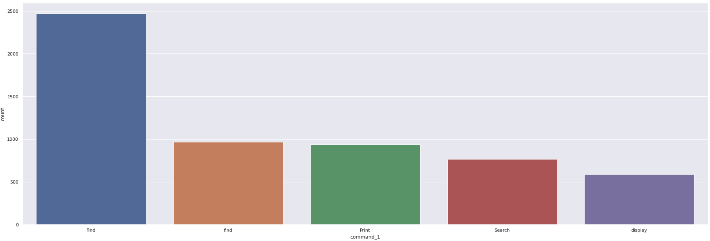
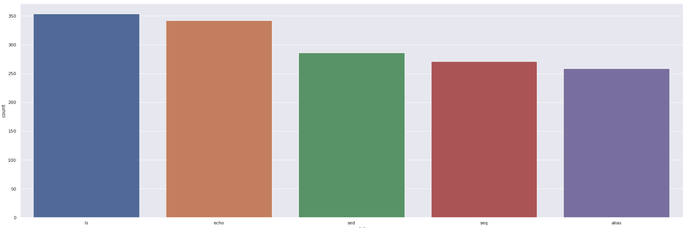
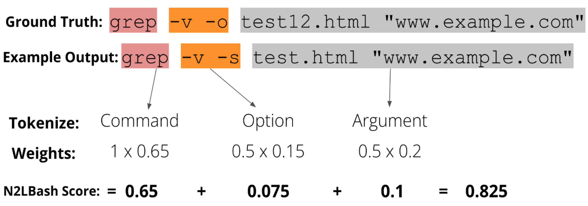
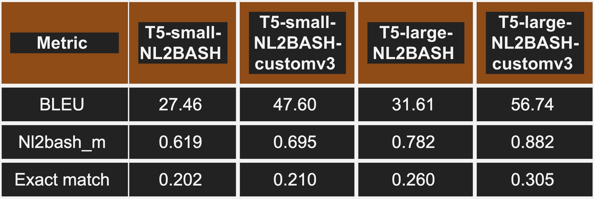

# ENG2Bash
ENG2Bash generates 25 of the most common bash commands from english text input with the goal of helping people learn bash. This is a proof-of-concept model using transfer learning to fine-tune an existing language model and produce structured code instead of natural language.

### Demo(Hugging Face): https://huggingface.co/Josh98/t5-large-t5large-English-to-BASH

## Custom Data + Data Processing 

 
1. (12k Pairs) The first model was trained using a custom iteration of [NL2Bash]([http://www.example.com](https://github.com/TellinaTool/nl2bash/tree/master/data) which contained 12k one-line Linux shell commands used in practice and their natural language descriptions provided by experts.
Solved class imbalance of this dataset. 

 
2. (3.6k pairs) After training on that dataset, A second model, using pretrained weights (tokenizer and model) from the custom NL2BASH model, was trained on a smaller training dataset consisting of 25 most commonly used BASH commands. The list of commands consists of:
- `ping`: Test network connectivity.
- `SSH`: Secure Shell, used for remote access.
- `apt-get`: Package management tool on Debian-based systems.
- `cat`: Concatenate and display the content of files.
- `cd`: Change directory.
- `chmod`: Change file permissions.
- `clear`: Clear the terminal screen.
- `cp`: Copy files or directories.
- `dir`: List files and directories in a directory.
- `echo`: Display a message or variable.
- `env`: Display or set environment variables.
- `free`: Display amount of free and used system memory.
- `get`: Not a standard command (may need clarification).
- `kill`: Terminate a process.
- `ls`: List files and directories.
- `mkdir`: Create a new directory.
- `mktemp`: Create a temporary file or directory.
- `mv`: Move or rename files or directories.
- `put`: Not a standard command (may need clarification).
- `pwd`: Print the current working directory.
- `rm`: Remove files or directories.
- `stat`: Display file or file system status.
- `top`: Display and update sorted information about system processes.
- `touch`: Create an empty file or update the access and modification time.
- `tree`: Display directory tree structure.
- `rmdir`: Remove an empty directory.
 
This generated datasets include custom-v1 with 389 command-description pairs generated manually using ChatGPT, custom-v2 with 846 pairs generated using GPT-3 API, and custom-v3 with 2419 pairs generated using GPT-3.5-turbo API. 
~3600 Pairs of dataset. 

## Custom Evaluation Metric
We use 2 metrics to evaluate our model. The first metric is a custom metric that we created for the specific purpose of measuring how good our model is at different aspects of the prediction. A general bash command has three parts, command, options/flags, and argument.  

[𝑐𝑜𝑚𝑚𝑎𝑛𝑑] [−𝑓𝑙𝑎𝑔(𝑠)/−𝑜𝑝𝑡𝑖𝑜𝑛(𝑠)] [𝑎𝑟𝑔𝑢𝑚𝑒𝑛𝑡(𝑠)] 

The importance of each part is different, so it makes sense to give them a weight that corresponds to their importance. The following steps are taken to accomplish custom metric calculation: 
1. Break down output/ref commands to unigrams (individual words)  
2. Group unigrams into 3 categories [commands], [Arguments], [Options]  
3. For each category, count the number of n-grams in output command that appear in reference cmd.  
4. Divide this by total number of n-grams in ref command.  
5. Multiple this by predefined weights for each category [commands], [Arguments], [Options] and add them together. 

## Results
The increase in the score of Nl2bash_m after training on the custom-v3 dataset is one of the most important observations shown in Table 1. This shows that the model's ability to understand the description is getting better, since the command and options contribute the most weight to the final score. 
Additionally, we see a significant increase in performance on all metrics when we switch from T5-small to T5-large. 

However, we are not able to get a high exact match score due to the variety of Linux bash commands. This could be improved by including a larger amount of training data and having a more diverse set of inputs.   
## Model Training

This repository contains a fine-tuned version of the T5-Large model for English-to-Bash translation. The model was trained on the None dataset and achieved the following results on the evaluation set:

- **Loss:** 0.6448
- **Nl2bash M:** 0.7181
- **Gen Len:** 14.2079

## Training Procedure

### Training Hyperparameters

The following hyperparameters were used during training:

- Learning Rate: 4e-05
- Train Batch Size: 16
- Eval Batch Size: 16
- Seed: 42
- Optimizer: Adam with betas=(0.9, 0.999) and epsilon=1e-08
- LR Scheduler Type: Linear
- Number of Epochs: 10

### Training Results

| Training Loss | Epoch | Step  | Validation Loss | Nl2bash M | Gen Len  |
|---------------|-------|-------|------------------|-----------|----------|
| 1.8995        | 1.0   | 561   | 1.1364           | 0.5124    | 13.7261  |
| 1.1669        | 2.0   | 1122  | 0.9093           | 0.5966    | 13.9349  |
| 0.9508        | 3.0   | 1683  | 0.8024           | 0.645     | 13.7716  |
| 0.8426        | 4.0   | 2244  | 0.7366           | 0.6696    | 13.9492  |
| 0.7574        | 5.0   | 2805  | 0.6994           | 0.6888    | 14.099   |
| 0.6884        | 6.0   | 3366  | 0.6756           | 0.6946    | 14.2498  |
| 0.6301        | 7.0   | 3927  | 0.6573           | 0.7101    | 14.3782  |
| 0.6031        | 8.0   | 4488  | 0.6476           | 0.7165    | 14.1793  |
| 0.5536        | 9.0   | 5049  | 0.6465           | 0.7164    | 14.1989  |
| 0.5443        | 10.0  | 5610  | 0.6448           | 0.7181    | 14.2079  |

### Authors
Josh Shih, Kevin Um, Alex Sha

## Acknowledgments

https://github.com/TellinaTool/nl2bash/tree/master/data
